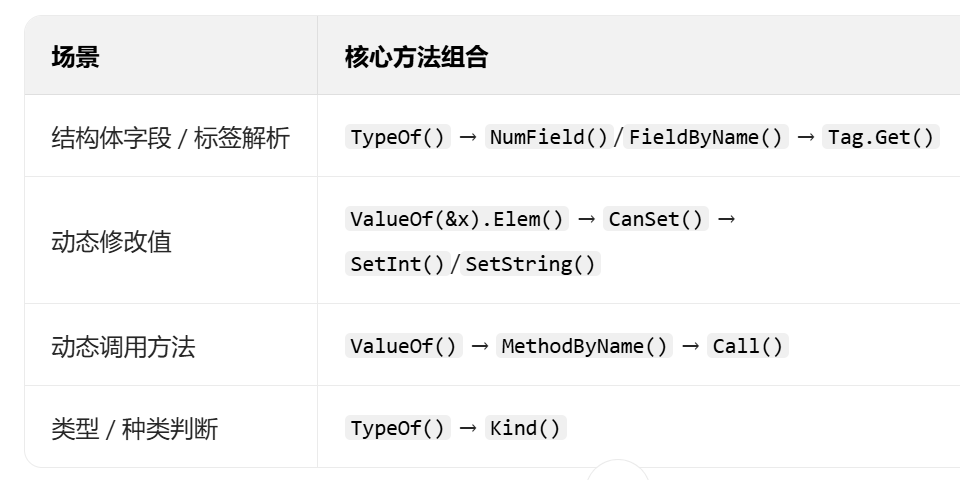
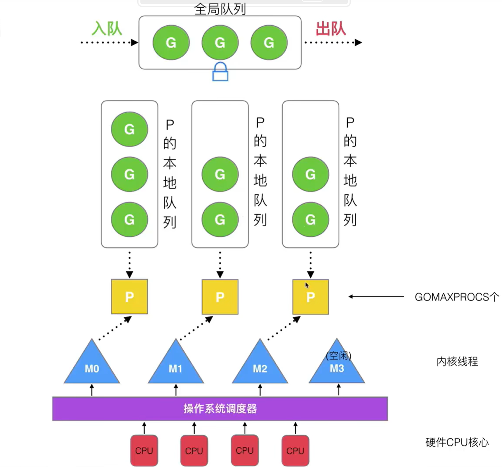
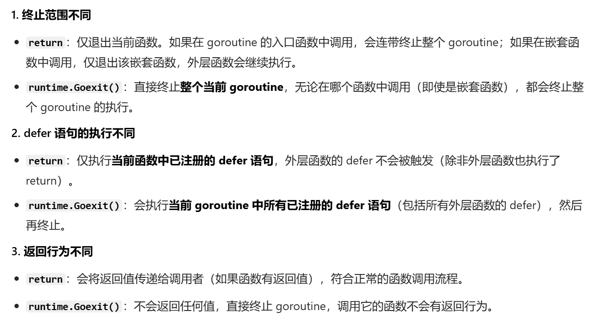
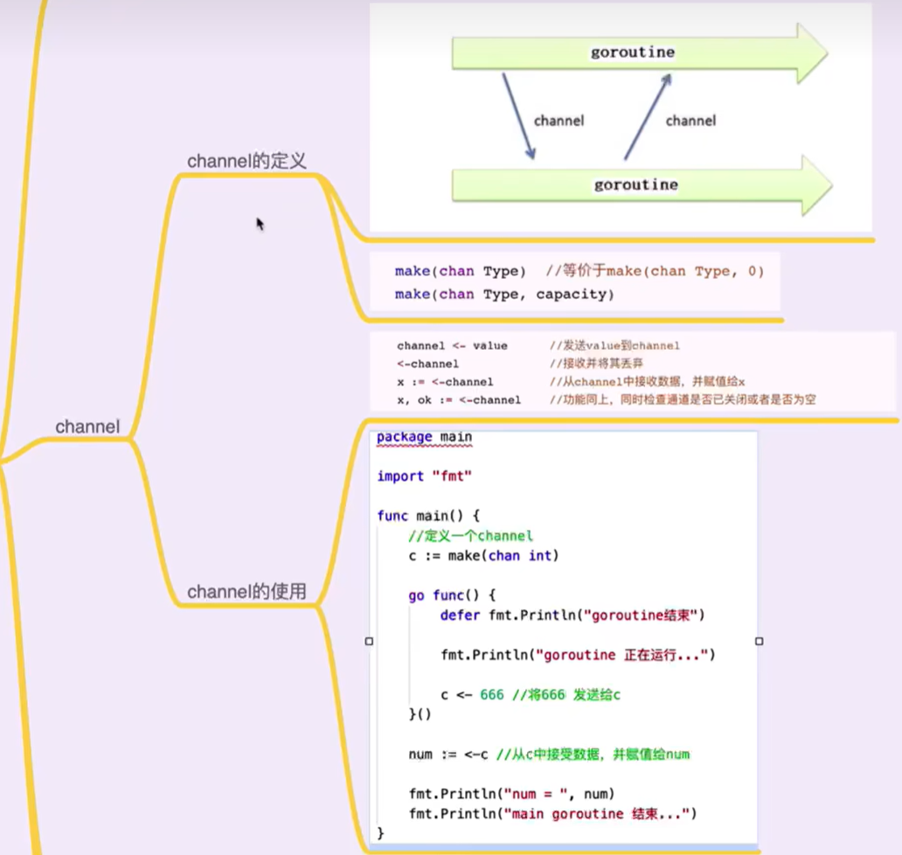
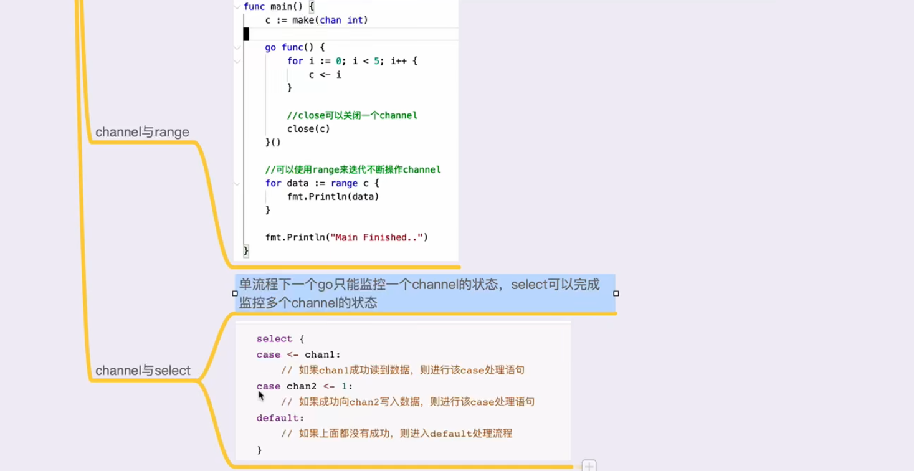

# Golang

## 其他
### 包
- `init() {}`
### 方法
- `defer`：类似finally，FILO

## 输入输出
- `n, err := fmt.Scan(&variable)`
- `fmt.PrintXX`

## 数组和Slice（切片）
### 概述
- 个人理解，在Golang中普通数组就是相当于基础数据类型，如`[4]int`，相当于在栈上申请了连续4个int空间并由一个变量保存地址直接管理。
```go
func printArray(arr [4]int) {
    arr[0] = -1
    for _, v := range arr {
        fmt.Println(v) // -1, 2, 3, 4
    }
}

func main() {
    arr := [4]int{1, 2, 3, 4}
    printArray(arr) // 值传递，将4个int复制给函数的参数对应内存，与main中arr无关

    for _, v := range arr {
        fmt.Println(v) // 1, 2, 3, 4
    }
}
```

- slice（切片）
```go
func main() {
    arr1 := []int{1, 2, 3, 4} // 此时arr1相当于指针或引用，并不直接对应数组的内存地址

    var arr2 []int = make([]int, 3) // len = cap = 3

    arr3 := make([]int, 3, 5) // len = 3, cap = 5
    
}
```

### Slice基本用法
- `arr = append(arr, val)`
- `len(arr)`
- `cap(arr)`
- `newArr := arr[_:_]`：截断（浅拷贝）
- `copy(newArr, arr)`：拷贝（深拷贝）
> 排序包sort：
> - 基本数据类型：`sort.Ints(arr)`、`sort.Float64s(arr)`、`sort.Strings (arr)`
> - 自定义类型：实现sort.Interface接口（`Len() int`、`Less(i, j int) bool`、`Swap(i, j int)`
> ```go 
> sort.Slice(users, func(i, j int) bool { 
>    return users[i].age < users[j].age}
>)
> ```

## map
### 初始化
```go
var myMap1 map[string]int
myMap1 = make(map[string]int, 10)
myMap1["one"] = 1

myMap2 := make(map[string]int) // 到这里就可以推断，make主要在堆上分配内存，所以基础数据类型及定长数组（内存都在栈上）不能make
// 其实还有new new就更像C++了 而且new可以new基础数据类型和自定义类型 返回指针

myMap3 := map[string]int {
    "one" : 1,
    "two" : 2,
}
```

### 常用方法
- `delete(myMap, KEY)`


## struct
- Golang中“名字”如果是大写开头则为`public`，小写则类似为Java的默认（仅本包可使用）
- `type myInt int`类似于`C++--typedef`
- `type MyClass struct {}`
```go
type Book struct {
    title string
    author string
}

func main() {
    var book Book // 这样定义，是分配在栈上
    book.title = "Golang"
    book.author = "kanade"
}
```

### 类的封装
```go
type Hero struct {
    Name string
    Ad int
    level int // 私有
}

func (ptr *Hero) Show() {
    ptr.Ad++ // GO中指针好像.就自动解引用了
    fmt.Printf("%+v\n", ptr);
}

func main() {
    hero := Hero{
        Name : "kanade",
        Ad : 1,
        level : 10,
    }

    // 相当于有Show(ptr *Hero)这个方法，此时hero.Show()相当于传入hero这个参数
    hero.Show() 
}

```


### 类的继承（组合）
```go
type A struct { x int }
func (a *A) Foo() { fmt.Println("A.Foo") }

type B struct { y int }
func (b *B) Bar() { fmt.Println("B.Bar") }

// 结构体C嵌入A和B
type C struct {
    A  // 嵌入A
    B  // 嵌入B
}

func main() {
    c := C{}
    c.Foo()  // 调用A的方法（方法提升）
    c.Bar()  // 调用B的方法（方法提升）
    fmt.Println(c.x)  // 访问A的字段（字段提升）
}
```


### 类的多态
Go 中没有关键字显式声明某个类型实现了某个接口。
只要一个类型实现了接口要求的所有方法，该类型就自动被认为实现了该接口。
```go
package main

import (
        "fmt"
        "math"
)

// 定义接口，相当于父类？
type Shape interface {
        Area() float64
        Perimeter() float64
}

// 定义一个结构体
type Circle struct {
        Radius float64
}

// Circle 实现 Shape 接口
func (c Circle) Area() float64 {
        return math.Pi * c.Radius * c.Radius
}

func (c Circle) Perimeter() float64 {
        return 2 * math.Pi * c.Radius
}

func main() {
        c := Circle{Radius: 5}
        var s Shape = c // 接口变量可以存储实现了接口的类型
        fmt.Println("Area:", s.Area())
        fmt.Println("Perimeter:", s.Perimeter())
}
```

> interface空接口`type interface{}  = any`，每一种类型都默认实现，可以作为万能变量类型（类似于Object）
> 断言机制：
> `variable, ok := arg.(Type)`


## 反射
### Pair
每个变量都维护一个类似Pair的东西，有`<type>, <value>`

### 基本方法
- `reflect.TypeOf(arg any) Type`
- `reflect.ValueOf(arg any) Value`



### Tag
它本质是给结构体字段附加的元数据（Metadata），“别处的称呼” 只是元数据的一种形式，还能包含配置规则、约束条件等信息，方便框架根据这些元数据处理字段。
```go
type StructName struct {
    FieldName Type `key1:"value1" key2:"value2,option"`
}
```

```go
type User struct {
    ID     int    `json:"id" db:"user_id" validate:"required,min=1"`
    Name   string `json:"name" db:"user_name" validate:"required,max=20"`
    Age    int    `json:"age,omitempty" db:"user_age"` // omitempty表示序列化时若值为0则忽略
    Email  string `json:"-"` // "-"表示序列化时忽略该字段
}
```


## 泛型
### 基本语法
```go
// 基本语法结构
func 函数名[T 约束](参数 T) 返回值类型 {
    // 函数体
}

type 类型名[T 约束] struct {
    // 结构体字段
}
```

### 各种约束
约束相当于Java中泛型 `T extends XX` 约束
- `any-interface{}`
- `comparable-[==, !=]`
- 其他约束
```go
// 数字类型约束
type Number interface {
    int | int8 | int16 | int32 | int64 |
    uint | uint8 | uint16 | uint32 | uint64 |
    float32 | float64
}

// 定义 Stringer 约束
type Stringer interface {
    String() string
}
```


## 异常
- `errors.New(msg string) error`


## 协程
### 概述
协程是用户态的轻量级执行单元，核心是解决传统线程在IO密集场景下“数量有限、阻塞闲置、调度开销大”的痛点。其通过用户态运行时预判阻塞操作，主动切换协程（无内核态调度开销），并以异步方式处理内核态IO，让少量载体线程（OS线程）可支撑海量并发任务，彻底规避线程阻塞带来的资源浪费与调度低效，实现高并发场景下的资源高效利用。


### GMP模型


- work stealing机制
- hand off机制
- 利用并行：GOMAXPROCS = CPU-corNum / 2
- 抢占
- 全局队列（有锁的保护）


### goroutine
- `go function`：直接调用
- 主动退出
```go
func main() {
    defer fmt.Println("A-defer")

    go func() {
        defer fmt.Println("B-defer")

        return // 主动让出
        // runtime.Goexit()
    }
}
```


### channel


> 

## GoModules


```go
module example/myproject  // 模块声明

go 1.21                  // Go 版本声明

require (
    github.com/gin-gonic/gin v1.9.1  // 依赖项1：模块路径 + 版本
    github.com/stretchr/testify v1.8.4  // 依赖项2
)

replace github.com/gin-gonic/gin => ../gin  // 替换依赖（本地开发用）

exclude github.com/stretchr/testify v1.8.3  // 排除特定版本
```